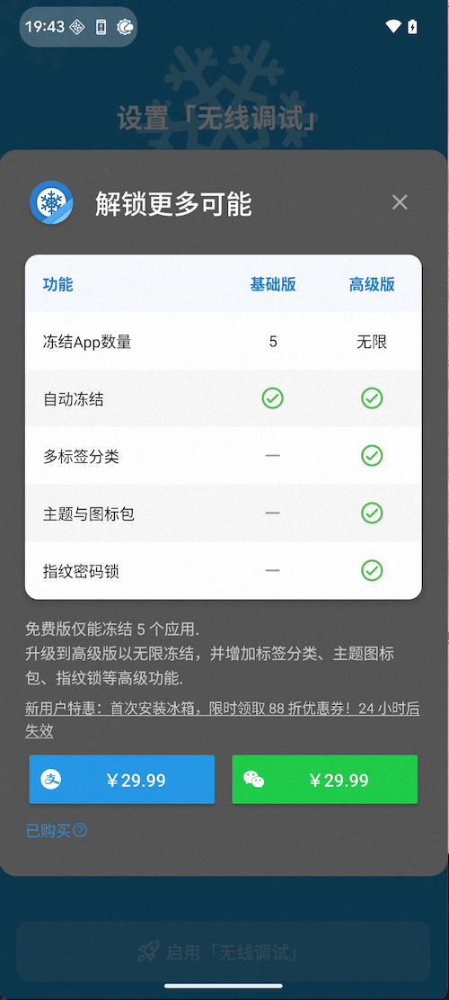
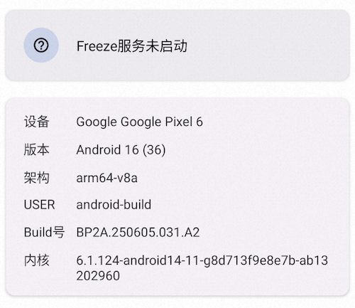
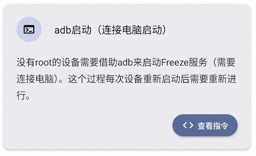
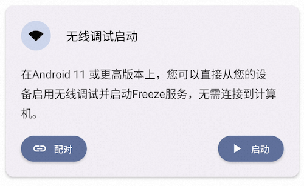
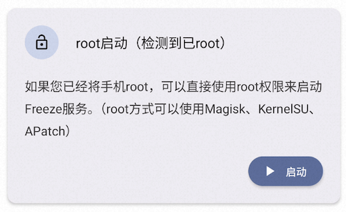
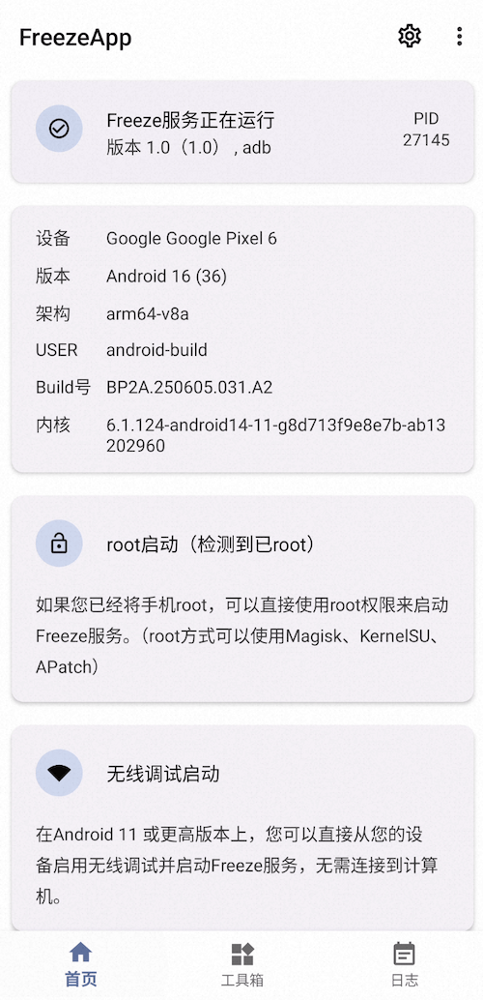
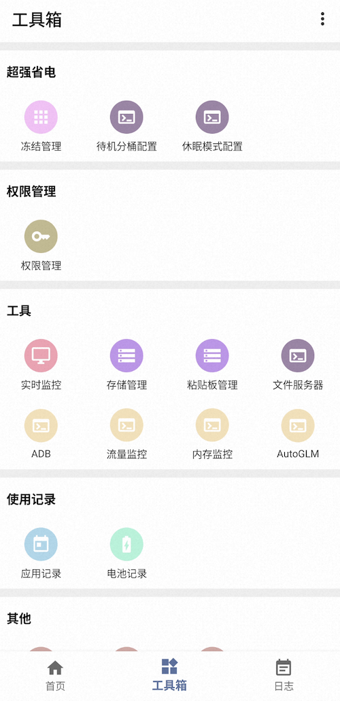

# FreezeApp
## 缘起
年初由于需要返乡，我希望手机中一些后台运行的应用能够被彻底“冻结”，避免它们在我不使用时消耗电量和流量。为此，我尝试下载了知名的冻结工具 Ice-Box，但发现其核心功能需要付费解锁，这与我个人推崇的开放、自由的技术理念背道而驰。出于对开源精神的坚持以及对系统级控制能力的探索欲望，我决定从零开始，自主研发一款功能全面、完全开源的 Android 冻结工具 —— FreezeApp。



经过持续的开发与迭代，FreezeApp 从最初仅支持基础的应用冻结功能，逐步成长为一个集多种系统管理能力于一体的综合性 Android 工具。在开发过程中，我深入学习并借鉴了多个优秀的开源项目（如 [Shizuku](https://github.com/RikkaApps/Shizuku)、AppOps等），结合自身需求进行创新整合，最终实现了远超预期的功能覆盖。
目前，FreezeApp 已具备以下核心功能模块：
* APP冻结管理

通过调用系统级 API 实现应用的深度冻结与解冻，可以有效阻止后台自启和服务唤醒，以及冻结之后应用将会隐藏。
* APP电池记录

追踪各应用的耗电情况，可视化展示历史功耗趋势，帮助用户识别“电量杀手”。
* App使用记录

基于 UsageStatsService 提供App使用时长记录，帮助用户了解自己的数字生活习惯。
* APP权限管理

通过AppOps 方式查看并修改应用权限状态，支持临时禁用敏感权限（如位置、相机、麦克风等）。
* APP实时监控

可以实时监听应用启动、以及可视化展示当前activity的名字。
* APP存储管理

查看缓存、数据大小，一键清理冗余文件，释放存储空间。
* APP粘贴板管理

监控并收集剪贴板内容，支持剪贴板历史记录复制，删除等。
* APP待机分桶

根据使用习惯自动或手动设置应用的待机分组（活跃、工作、频繁、稀少、受限），优化系统资源调度。
* APP休眠模式（白名单配置）

通过配置应用黑白名单，优化系统资源调度。
* APP外屏配置（小米 MIX FLIP）

通过scale方式修改外屏显示。
* APP文件服务器(支持根目录和App内置沙盒目录)

内置轻量级 HTTP 文件服务，支持共享根目录或特定 App 沙盒内的文件，便于跨设备传输，无需 root 即可安全访问。
* APP流量监控

通过独立的 Daemon 进程持续监控移动数据使用情况，当应用超出预设阈值时触发告警或自动冻结，防止流量超标。
* APP内存监控

利用 dumpsys meminfo --package 命令定期采集内存占用数据，分析内存泄漏风险，辅助性能调优。
* APP AutoGLM

将开源项目 Open-AutoGLM 的核心逻辑从 Python 重写为 Java，并深度集成进 FreezeApp。

## 使用
* 首次打开app，会显示“Freeze服务未启动”，支持多种启动方式。

  
  
  ```shell
    adb shell sh /storage/emulated/0/Android/data/com.john.freezeapp/files/start.sh
  ```
* adb启动

  
* 无线调试启动（开启开发者模式，根据引导依次开启）

  
* root方式启动（一键启动）

  
* 启动成功

  
* 功能列表

  
